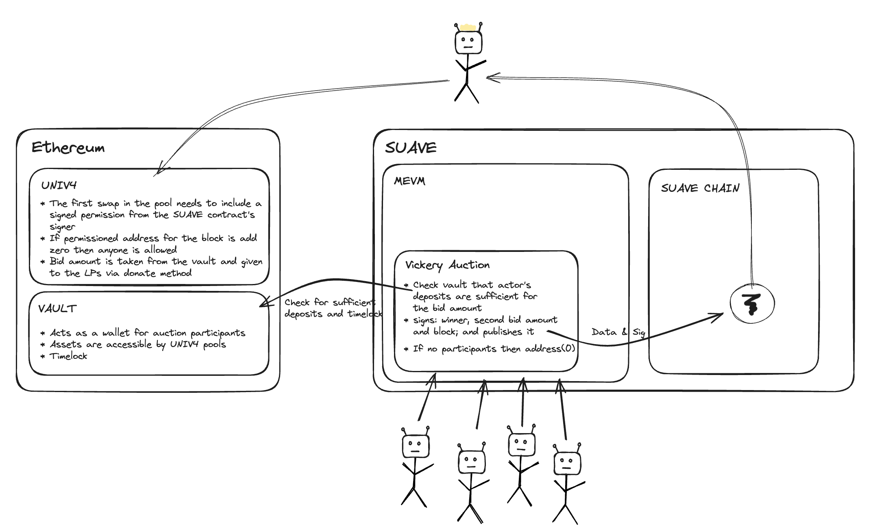

# LVooooors @ ETHGlobalLondon 2024

## tl;dr:

We fix LVR (loss versus rebalancing, esp. wrt CEX) in Uniswap v4 pools by distributing the arbitrage MEV back to LPs. We achieve this with v4 hooks that utilise external SUAVE calls to run credible second-bid (Vickery) auctions for top-of-block swap rights.



https://app.excalidraw.com/l/ZvFp528akJ/3OK2MBMiduH


## Design

### Goal

- Achieve a mechanism that would lead to redistributing a maximum amount of LVR MEV back to LPs without rendering the DEX unresponsive or otherwise unattractive

### High level

Fixing LVR (loss versus rebalancing, esp. wrt CEX) in Uniswap v4 pools works by requiring arbitrageurs to bid for first transaction rights for a particular pool they are attempting extra MEV from. Fees collected from auctioning first execution rights are then redistributed back to LPs by donating to the pools the fees were collected from.

We achieve this with v4 hooks that utilise external SUAVE calls to run credible second-bid (Vickery) auctions for top-of-block swap rights.

Specifically, SUAVE trusted execution environments run credible auctions for any chain where bidders submit private bids close to block creation time of the chain they want to execute an arb on. Payment for the bids is provided ahead of time to a contract which acts as a deposit registry. The contract stores funds for Arbers allowing them to bid on multiple auctions on different pools without explicitly providing a different deposits each time. Funds are only taken from Arber deposits when they win the right to have preferential transaction inclusion in a block and donated to the LPs of the Pool.

The SUAVE auction resolves quickly providing a signed message which can then be passed to the Uniswap V4 pool as additional hookData. A prehook call then verifies the validity of the signed data and compares it to the swap that has been submitted. If valid, an execution ordering condition is imposed on sucessful execution of transactions for this pool imposing ordering on block builders.

### Assumptions

- Block builders will bundle (knapsack problem) mempool transactions into an ordering that actually puts the special arb-swap transaction from the auction winner first within all pool transactions for said block ("pool-top-of-block") because it's the only ordering that doesn't lead to a revert
  - This will be particularly non-problematic if the system attracts enough traffic to be seen by block builers who would render their algorithms aware of the auction-winning mechanism
  - Multiple parallel simulations should result in the valid combination becoming readily apparent even without explicit ordering suggestions sent to the builders.
- There will be MEV potential so more sophisticated actors will submit non-zero bids close to the block deadline
  - Timing needs to be in sync between the settlement layer and SUAVE
  - If no traffic/interest, no bid will be submitted and the DEX will be blocked for a block - but this will result in a larger deviation from the real price, increasing the LVR value and increasing the chances that an actor would submit a bid
  - If still no traffic, we could run an altruistic bot to every now and then submit a special zero-value bid to unlock the DEX
- Given sufficient "critical mass", the credible second-bid auction will lead to most of the LVR EV being reflected in the auction proceeds, therefore making execution more equitable and closer to a CEX experience
- In order to maximise the redistributable LVR value, the SUAVE auction needs to be finalised as close to the next settlement layer (ultimately, Ethereum) block proposal deadline (currently expected to be t=4s within a slot) as possible in order to be able to leave the "real" (CEX) market the maximum time to potentially move away from the "stale" DEX state, but without risking missing the deadline too much. We'd therefore start by having the SUAVE auction finalise e.g. 500 ms before the block deadline, then benchmark and adjust if needed. To achieve that, we might have to run a custom instantiation of the SUAVE blockchain running at a precise phase offset (500 ms) wrt Ethereum, e.g. exactly three SUAVE blocks per one Ethereum block (Rigil is currently sealing blocks at 4s block time (not sure about the phase), but using the non-time-precise Clique POA that will be subject to change by Flashbots soon).


## Project Setup

Requires [foundry](https://book.getfoundry.sh):

```
forge install
```


## Development and Testing

### Local Unit Tests

See [./test](./test), run with `forge test`.


### Anvil

```bash
# start anvil with TSTORE support
# (`foundryup`` to update if cancun is not an option)
anvil --hardfork cancun

# in a new terminal
forge script script/Anvil.s.sol \
    --rpc-url http://localhost:8545 \
    --private-key 0xac0974bec39a17e36ba4a6b4d238ff944bacb478cbed5efcae784d7bf4f2ff80 \
    --broadcast
```


### Testnet Deployment

Note: Both Ethereum Goerli and Ethereum Sepolia are NOT supported by Uniswap v4 currently.

However, we were able to deploy our hook, create a pool, add liquidity and swap successfully using Arbitrum Sepolia. 

Further testnets presumed to be functional (as of 17 March 2024):

```
https://sepolia-rollup.arbitrum.io/rpc
- PoolManager deployed to 0xE5dF461803a59292c6c03978c17857479c40bc46
- PoolModifyLiquidityTest deployed to 0xd962b16F4ec712D705106674E944B04614F077be
- PoolSwapTest deployed to 0x5bA874E13D2Cf3161F89D1B1d1732D14226dBF16

https://sepolia.base.org
- PoolManager deployed to 0xd962b16F4ec712D705106674E944B04614F077be
- PoolModifyLiquidityTest deployed to 0x5bA874E13D2Cf3161F89D1B1d1732D14226dBF16
- PoolSwapTest deployed to 0x60AbEb98b3b95A0c5786261c1Ab830e3D2383F9e

https://sepolia.optimism.io
- PoolManager deployed to 0xb673AE03413860776497B8C9b3E3F8d4D8745cB3
- PoolModifyLiquidityTest deployed to 0x862Fa52D0c8Bca8fBCB5213C9FEbC49c87A52912
- PoolSwapTest deployed to 0x30654C69B212AD057E817EcA26da6c5edA32E2E7

https://rpc.ankr.com/polygon_mumbai
- PoolManager deployed to 0xf3A39C86dbd13C45365E57FB90fe413371F65AF8
- PoolModifyLiquidityTest deployed to 0xFDABa2b9C369C25f5834334612c0855497942788
- PoolSwapTest deployed to 0x76870DEbef0BE25589A5CddCe9B1D99276C73B4e

https://rpc.public.zkevm-test.net
- PoolManager deployed to 0x615bCf3371F7daF8E8f7d26db10e12F0F4830C94
- PoolModifyLiquidityTest deployed to 0x3A0c2cF7c40A7B417AE9aB6ccBF60e86d8437395
- PoolSwapTest deployed to 0x3D5e538D212b05bc4b3F70520189AA3dEA588B1E
```

To deploy to a testnet, run scripts from [./script](./script), e.g.:
```
forge script script/00_BidRegistry.s.sol \
--rpc-url https://sepolia-rollup.arbitrum.io/rpc \
--private-key [your_private_key_on_separbitrum_here] \
--broadcast
```

#### *Deploying your own Tokens For Testing*

Because v4 is still in testing mode, most networks don't have liquidity pools live on v4 testnets. We recommend launching your own test tokens and expirementing with them that:

```
forge create script/mocks/mUNI.sol:MockUNI \
--rpc-url [your_rpc_url_here] \
--private-key [your_private_key_here]
```

```
forge create script/mocks/mUSDC.sol:MockUSDC \
--rpc-url [your_rpc_url_here] \
--private-key [your_private_key_here]
```

## Troubleshooting

### Permission Denied

When installing dependencies with `forge install`, Github may throw a `Permission Denied` error

Typically caused by missing Github SSH keys, and can be resolved by following the steps [here](https://docs.github.com/en/github/authenticating-to-github/connecting-to-github-with-ssh) 

Or [adding the keys to your ssh-agent](https://docs.github.com/en/authentication/connecting-to-github-with-ssh/generating-a-new-ssh-key-and-adding-it-to-the-ssh-agent#adding-your-ssh-key-to-the-ssh-agent), if you have already uploaded SSH keys

### Hook Deployment Failures

Hook deployment failures are caused by incorrect flags or incorrect salt mining

1. Verify the flags are in agreement:
    * `getHookCalls()` returns the correct flags
    * `flags` provided to `HookMiner.find(...)`
2. Verify salt mining is correct:
    * In **forge test**: the *deploye*r for: `new Hook{salt: salt}(...)` and `HookMiner.find(deployer, ...)` are the same. This will be `address(this)`. If using `vm.prank`, the deployer will be the pranking address
    * In **forge script**: the deployer must be the CREATE2 Proxy: `0x4e59b44847b379578588920cA78FbF26c0B4956C`
        * If anvil does not have the CREATE2 deployer, your foundry may be out of date. You can update it with `foundryup`


### Additional Resources

[v4-periphery](https://github.com/uniswap/v4-periphery) contains advanced hook implementations that serve as a great reference

[v4-core](https://github.com/uniswap/v4-core)

[v4-by-example](https://v4-by-example.org)


## Hackathon Deployment

- Token1 LVRST1: https://sepolia.arbiscan.io/token/0xa47757c742f4177de4eea192380127f8b62455f5
- Token2 LVRST2: https://sepolia.arbiscan.io/token/0xfda93151f6146f763d3a80ddb4c5c7b268469465
- BidRegistry: https://sepolia.arbiscan.io/address/0xa43e520783230a2347946EAC7946A92a8379781c (cf. LvrShield.sol)
- LvrShield hook: https://sepolia.arbiscan.io/address/0x030e0A80f42E3b943a4599B6E3F1712214511386 (cf. 01-03 scripts)
- PoolID: `0xb707601b547d329c2588a18b028d6b20ff75c5f6f364c133ad05b8785a1df7e3`
- SUAVE contract: https://explorer.rigil.suave.flashbots.net/address/0xfa3F11B48F58E72ECaF3ba7fdcAe9b4341822ED8


## Hackathon Observations

- Arbitrum-Sepolia RPC sometimes throws this error: `It looks like you're trying to fork from an older block with a non-archive node which is not supported. Please try to change your RPC url to an archive node if the issue persists.`. Workaround: Just re-run the deployment script.
- https://github.com/Uniswap/docs/pull/676 


## Limitations & Future Work

- Block number checks per pool-top-of-block auction winner checks needs to be re-enabled; disabled currently as:
  - Uniswap v4 isn't deployable to Ethereum (Sepolia) due to contract storage out of gas issues, so we temporarily use a fast-blocktime L2 (Arbitrum Sepolia) for testing
  - Getting cross-network time-syncing (precise phase offset) right is non-trivial, in particular with the currently deploye Clique PoA on SUAVE; it will probably require a re-instantiation of SUAVE, too
- Support special zero-value bid type (towards unlocking a potentially stuck DEX during low-traffic periods)


## Prizes/Bounties

### Uniswap Foundation

Bounty tracks:
- Hooks & External Integrations
  - External calls to SUAVE for credible second-bid auctioning from within a v4 before-swap hook
  - Top-of-block (per pool) logic via a v4 after-swap hook
  - Submitted as https://uniswaphooks.com/hooks/hook/d96453a2-14ce-4172-ac48-5279e4257e48 (under review)

### Flashbots

Bounty tracks:
- Offchain Auction Protocol
  - Second-bid (Vickery) auction for top-of-block per v4 pool
- Most Unique Offchain App
  - HTTP requests to align SUAVE with v4's settlement layer (e.g. Arbitrum Sepolia)

### Nethermind

Bounty tracks: 
- MEV innovation
  - Auction mechanism to redistribute parts of MEV (parts of LVR) back to pool LPs
- Institutional blockchain solutions
  - Make LP-ing on a DEX more attractive for sophisticated players able to follow CEX price feeds in near-time and reflect their EV in the (sealed second-bid) auction bidding strategy when bidding for top-of-block rights — while making LP-ing more equitable and predictive overall
